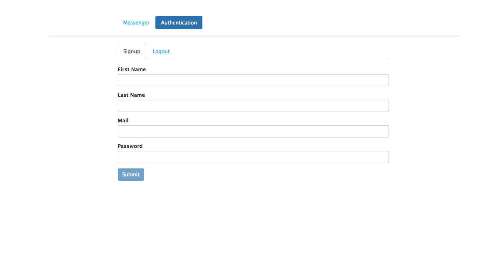
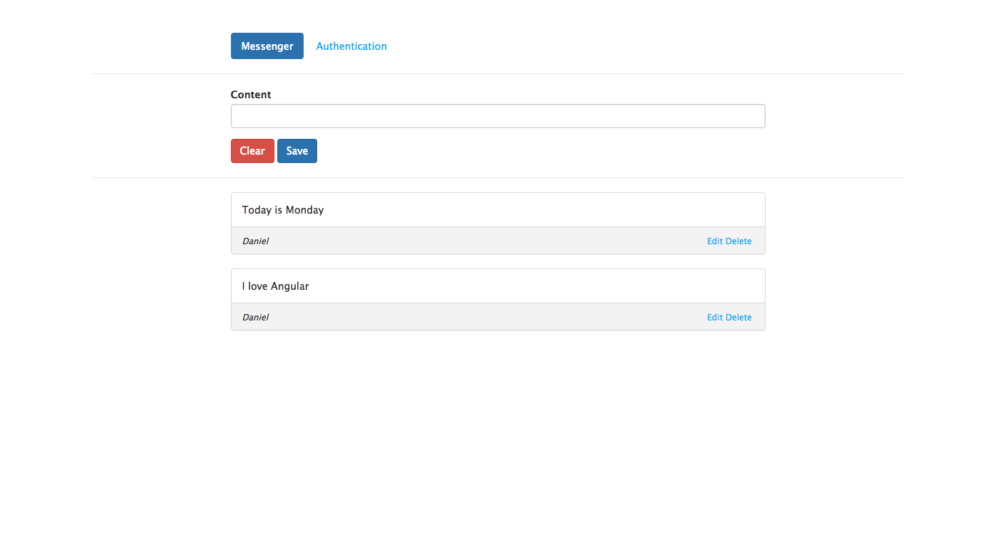
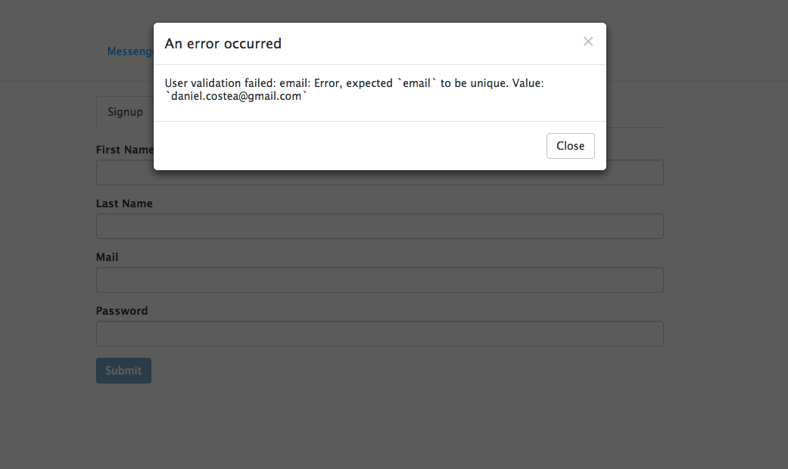

## Messages app

* This project is  build using the MEAN stack

### Development server

 * Open the shell command and run MongoDB
 * In another shell run 'npm run build'
 * In another shell run 'npm start'

### Project functionality

* I build this project using the MEAN stack
* I have Angular 2 as a Front-End technology and in the Back-End I'm using NodeJs with Express as a server, MongoDB as a database  and Mongoose, a ORM that connects the MongoDB with my server
* The project is structured in numerous components for keeping the code clean and easy to follow  
* The project includes an authentication feature in which the user can sign up, log in and log out.I am using Bcrypt for password protection:
  * User data is stored in MongoDB, with the passwords hashed
  * CRUD functions are built in an Express API – Create (register), Read (login, get profile), Update, Delete
  * The Angular application calls the API and deals with the responses
  * The Express API generates a JSON Web Token (JWT) upon registration or login, and passes this to the Angular application
  * The Angular application stores the JWT in order to maintain the user’s session
  * The Angular application checks the validity of the JWT when displaying protected views
  * The Angular application passes the JWT back to Express when calling protected API routes
* Version control used: Git

### Project functionality

#### You can register as a new user

#### Only the registered user can add new messages.You can edit or delete the messages

#### At sign up, email must be unique otherwise an error message is displayed

